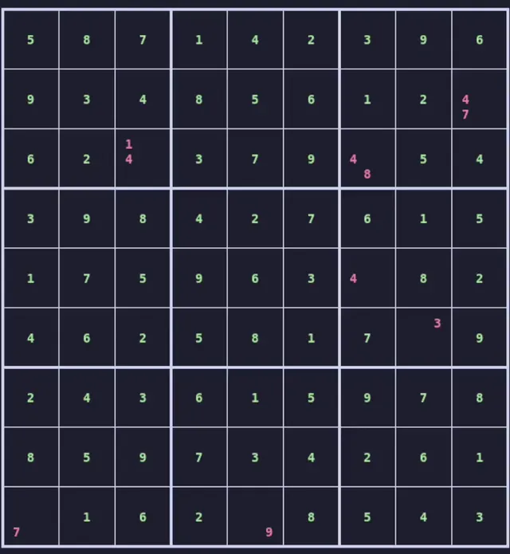
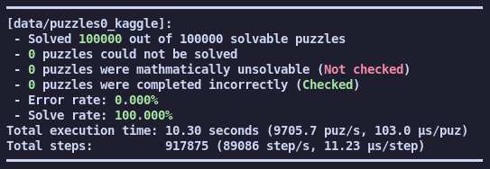

# Sudoku Solver

Sudoku solver implementation in C with multiple solving techniques including candidate elimination, exclusive candidates, row/column elimination, and recursive backtracking.



Stats for `data/puzzles0_kaggle`:



## Usage

Build:
```bash
make sudoku-strict
```

Process all puzzles in data directory:
```bash
make runall
```

Extract puzzle sets (required before runall):
```bash
make extract
```

Run single puzzle:
```bash
./sudoku.o [puzzle_file]
```

## Configuration

Settings can be modified in `include/flags.h`:

- `display_solve` - Show solving animation with step delays
    - `display_candidates` - Show candidate numbers in grid cells
    - `display_step_time` - Animation delay in seconds (default: 0.5)
- `stop_on_incorrect` - Halt execution on incorrect solutions
- `stop_on_cant_solve` - Halt execution on unsolvable puzzles
- `one_puzzle_only` - Solve only puzzle at specific index (-1 for all)
- `check_solvable` - Verify puzzle is mathematically solvable
- `check_incorrect` - Verify solution correctness
- `recursion_limit` - Maximum recursive backtracking depth (default: 2)